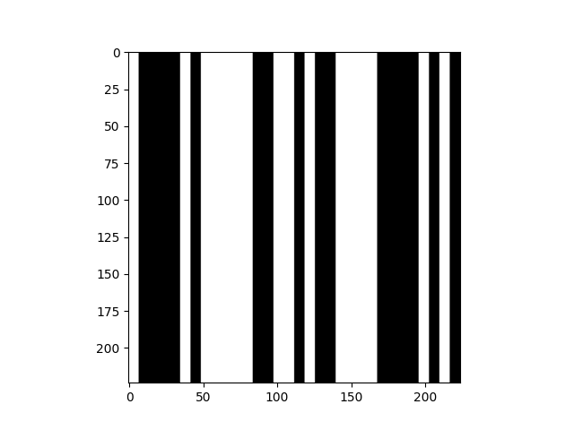

# HW2: Neural Fitting

---

## Overview

In our previous assignment, we trained an AlexNet model on ImageNet and examined its learned kernels to understand what features they capture and how they respond to various visual stimuli.

In this homework, we extend that investigation by probing the network's representations to determine how well they explain neural activity recorded from the human brain. Using fMRI data from the Natural Scenes Dataset (NSD), which includes responses from early visual areas (V1–V4) and higher-order regions, we will perform neural fitting—mapping the intermediate features extracted from different layers of AlexNet to the measured brain responses via ridge regression. By comparing models trained on different tasks (e.g., ImageNet versus a synthetic Barcode dataset) and even an untrained model, we aim to uncover which representations align best with the brain's processing of natural scenes, thereby shedding light on the correspondence between artificial neural networks and biological visual systems.

You will extend your work from HW1 by repurposing your AlexNet training pipeline and exploring neural representations via neural fitting. In particular, you will:

1. **Modify your HW1 training script** to train AlexNet on a synthetic **Barcode Dataset** instead of ImageNet. In this dataset, each sample is a 224×224 RGB “barcode” image generated from a 32-bit unsigned integer. Your model’s task is to predict the 32-bit binary representation of the input integer.

2. **Implement neural fitting on the Natural Scenes Dataset (NSD):**  
Write a second script that loads the NSD images and their corresponding neural activation data, extracts embeddings from your trained AlexNet after several intermediate layers, and then fit these embeddings to the NSD neural activations using ridge regression. Finally, compute and report the coefficient of determination (r²) for each layer's fit.

3. **Analyze the outcomes of the predicted brain responses:**
Evaluate and interpret the mapping correlations between the model features and brain data. Compare the performance of different model variants—namely, the randomly initialized model, the ImageNet-trained model, and the Barcode-trained model—to determine which one best predicts the brain responses. Discuss how the representational similarity varies across layers and brain areas, and provide insights into why certain models or layers may align better with neural activity than others.

---

Before You Begin:
Activate the cs375 environment using micromamba by running:

```bash
micromamba activate cs375
```
Then, install the additional required packages with:

```bash
pip install pandas xarray scipy scikit-learn gdown
```

This ensures you have all the necessary tools to run the code successfully.

---

## Background

### AlexNet Recap

Recall that AlexNet consists of five convolutional layers followed by three fully connected layers. In HW1 you implemented a single-GPU version of AlexNet for ImageNet classification. For HW2 you will modify this network in two ways:

- **Task Change:** Instead of classifying 1,000 ImageNet categories, set up a variant of the network that will output 32 values corresponding to the bits of a barcode.
- **Neural Fitting:** Later you will extract intermediate activations (embeddings) after each convolutional layer to compare with neural data recorded during natural scene viewing.

### Barcode Dataset

The **Barcode Dataset** is a synthetic dataset where every sample is generated from a 32-bit unsigned integer. Each integer is converted into a 224×224 RGB “barcode” image with 32 vertical stripes (each stripe is 7 pixels wide). The label is a 32-element binary vector representing the integer.

Below is the provided implementation of the Barcode dataset class. **Be sure to replace your ImageNet data loading code from HW1 with this Barcode dataset code.**

---

### Barcode Dataset Code

```python
import os
import math
import random
import numpy as np
import torch
from torch.utils.data import Dataset

class BarcodeDataset(Dataset):
    """
    A Dataset that yields (image, label) pairs for 32-bit unsigned integers.
    Each integer is converted to a 224x224x3 “barcode” image with 32 vertical
    stripes (each stripe is 7 pixels wide and 224 pixels tall).
    
    - 'split': either 'train' or 'val'
    - 'length': how many samples per epoch
    - 'val_numbers': a list of unique integers used ONLY for validation
    - 'seed': to control reproducibility (only used for training)
    """
    def __init__(self, split: str, length: int, val_numbers: list, seed: int = 1110):
        super().__init__()
        assert split in ['train', 'val']
        self.split = split
        self.length = length
        self.val_numbers = val_numbers
        
        # For reproducible random sampling
        self.rng = random.Random(seed if split == 'train' else seed + 9999)

        # Convert val_numbers to a set for quick membership checks
        self.val_set = set(val_numbers)
        self.max_uint32 = 2**32  # 0 to 2^32-1

        # For val split, we'll store val_numbers as a list
        if self.split == 'val':
            self.val_numbers_list = list(self.val_numbers)
            self.rng.shuffle(self.val_numbers_list)

    def __len__(self):
        # We define the 'epoch size' as self.length
        return self.length

    def __getitem__(self, index):
        if self.split == 'train':
            # Randomly pick a number not in the validation set
            while True:
                candidate = self.rng.randrange(0, self.max_uint32)
                if candidate not in self.val_set:
                    number = candidate
                    break
        else:
            # Validation: pick from val_numbers_list (cycling if needed)
            number = self.val_numbers_list[index % len(self.val_numbers_list)]

        # Build the (image, label) pair
        img_tensor = self.make_barcode_data(number)      # shape: [3, 224, 224]
        label_tensor = self.int_to_32bit_label(number)     # shape: [32]
        return img_tensor, label_tensor

    @staticmethod
    def make_barcode_data(number: int) -> torch.Tensor:
        """
        Given an unsigned 32-bit integer, produce a 224x224x3 “barcode” image.
        - 32 vertical stripes, each 7 pixels wide => total width = 224
        - Stripe i is black if bit i=1, white if bit i=0.
        """
        # Convert to a 32-bit binary array (bit 31 = LSB, bit 0 = MSB)
        bits = [(number >> i) & 1 for i in range(32)]
        bits.reverse()  # Now bits[0] is the MSB, bits[31] is the LSB

        # Create blank white image [H=224, W=224, C=3]
        img = np.ones((224, 224, 3), dtype=np.float32)  # 1.0 = white

        # Fill stripes for bits=1 with black (0.0)
        for i, bit in enumerate(bits):
            col_start = i * 7
            col_end = col_start + 7
            if bit == 1:
                img[:, col_start:col_end, :] = 0.0

        # Convert to torch tensor, shape [3, 224, 224]
        img_tensor = torch.from_numpy(img).permute(2, 0, 1)
        return img_tensor

    @staticmethod
    def int_to_32bit_label(number: int) -> torch.Tensor:
        """
        Convert the integer into a 32-bit binary label (0/1) (float32).
        bits[0] = MSB, bits[31] = LSB.
        """
        bits = [(number >> i) & 1 for i in range(32)]
        bits.reverse()
        return torch.tensor(bits, dtype=torch.float32)
```

Here is an exmaple of a barcode produced by this dataset:



Can you tell what the label is supose to be?

### Modified AlexNet for Barcode Classification

For this part of the assignment, you will repurpose your existing HW1 training pipeline to work with the Barcode dataset rather than ImageNet. Follow these key steps:

1. **Update Your Training Script:**
   - **Copy `train.py` from HW1:** Begin with your existing training script from HW1.
   - **Replace the Dataset:** Modify the data-loading section to use the Barcode dataset instead of ImageNet. Recall that the Barcode dataset generates 224×224 RGB images from 32-bit unsigned integers, with each image paired with a 32-element binary vector as its label.

2. **Adjust the AlexNet Model:**
   - **Modify the Output Layer:** Change the final fully connected layer of AlexNet so that it outputs 32 values instead of 1,000. This change ensures that the model’s output corresponds to the 32 bits required for the Barcode task.

3. **Change the Loss Function:**
   - **From Cross-Entropy to Binary Cross Entropy (BCE):**  
     In HW1, you likely used the cross-entropy loss function, which is ideal for multi-class classification tasks (such as ImageNet). However, for barcode classification, each of the 32 outputs represents an independent binary prediction (0 or 1). Therefore, the binary cross-entropy loss is more appropriate.
     
   - **Binary Cross Entropy Loss Equation:**  
     The binary cross-entropy (BCE) loss for a single sample is defined as:
     
     $
     \text{BCE}(y, \hat{y}) = -\frac{1}{N} \sum_{i=1}^{N} \left[ y_i \log\bigl(\sigma(\hat{y}_i)\bigr) + (1 - y_i) \log\bigl(1 - \sigma(\hat{y}_i)\bigr) \right]
     $
     
     where:
     
     - $N = 32$ is the number of bits,
     - $y_i$ is the ground truth label for the $ i^\text{th} $ bit (0 or 1),
     - $\hat{y}_i$ is the model's raw output (logit) for the $ i^\text{th}$ bit,
     - $\sigma(\cdot)$ denotes the sigmoid function, which converts logits into probabilities.
     
   - **PyTorch Implementation:**  
     PyTorch already provides an implementation of this loss via `nn.BCEWithLogitsLoss`, which combines the sigmoid activation and the binary cross-entropy loss into one stable function.

4. **Change the Model Save File Name:**
   - **Update the Save File Name:**  
     Ensure that you update the model save file name in your training script. This change will prevent you from accidentally overwriting your previous ImageNet-trained model. For instance, you might choose to save your Barcode-trained model as `barcode.pt`.

**Training the Barcode AlexNet:**

After making these modifications, run your updated training script to train the Barcode AlexNet model. Note that this task is generally easier than ImageNet classification, so the model should train much faster. However, note the number of epochs required to reach high performance. Also save the filter visualizaitons as with HW1.


## Neural Fitting with the NSD

In this part of the assignment, you will investigate how well the intermediate representations from your modified AlexNet models can predict fMRI responses measured during natural scene viewing. This analysis is based on the Natural Scenes Dataset (NSD; Allen et al., 2021). The NSD contains 1,000 shared natural scene images, each presented three times to subjects, and corresponding fMRI data recorded from several brain regions. The images are high-resolution natural scenes, while the fMRI recordings were taken from visual areas (V1, V2, V3, V4) and additional higher-order regions organized into upper streams—namely, the upper ventral, upper parietal, and upper lateral areas. 
You will find starter code for this in the file called `nsd.py` Below, we explain each major block of the provided file and describe in detail the TODOs that you must implement.

### NSD Dataset and Brain Regions

#### Background on fMRI

Functional Magnetic Resonance Imaging (fMRI) is a non-invasive neuroimaging technique that measures brain activity by detecting changes in blood oxygenation levels. During an fMRI scan, the brain is divided into small three-dimensional units called voxels—each representing a tiny cubic volume of tissue. These voxels capture the Blood Oxygen Level Dependent (BOLD) signal, which serves as an indirect proxy for neural activity. Unlike direct measurements of electrical signals, the BOLD signal reflects the hemodynamic response (i.e., blood flow changes) associated with neural activation, making each voxel akin to a pixel in a 3D image of the brain.

Because the BOLD signal is affected not only by neuronal activity but also by various sources of physiological and instrumental noise (such as head motion, vascular differences, and scanner artifacts), the fMRI data are inherently noisy. To account for this noise in our analyses, we introduce the concept of a noise ceiling. The noise ceiling represents the maximum explainable variance in the fMRI measurements given their noise level. When mapping model predictions to fMRI responses, we normalize our predictions by dividing the coefficient of determination (R²) by the computed noise ceiling. This normalization yields a metric that reflects the fraction of the explainable variance captured by the model, allowing for a fairer comparison across different brain regions and subjects where noise levels may vary significantly.

#### Natural Images:
The NSD includes 2,000 train and 1,000 test natural scene images that have been preprocessed and are available as RGB images. The images depict real-world scenes and are used to study visual processing under naturalistic conditions.

#### Brain Regions:
You will be examining the following brain regions: V1, V2, V3, V4, and the upper ventral, lateral, and parietal areas. V1, the primary visual cortex, processes basic visual information such as edges and orientations, while V2 through V4 are successive stages that handle increasingly complex features. Additionally, you will study three upper regions: the upper ventral area, which is associated with object recognition and form representation; the upper parietal area, which plays a role in spatial attention and processing spatial relations; and the upper lateral area, which is involved in processing dynamic aspects and object motion, among other functions.

#### Data Preprocessing and Feature Extraction
You will load the fMRI data for the four visual areas from the provided NetCDF files. A helper function (e.g., load_fmri(file_path)) is provided for this purpose. This function should average over the time_bin dimension and across repeats so that, for each brain region, you obtain a 2D array of shape (1000, n_neuroid)—that is, 1,000 images each for train, val and test by the number of recorded neuroids (voxels). You will join the trian and val images into a single trian set.
You will then create a dictionary (e.g., fmri_dict) that maps each region (keys: 'V1', 'V2', 'V3', 'V4', 'ventral', 'parietal', 'lateral') to its corresponding averaged fMRI response array.

---

### 1. IMPORT LIBRARIES & SET GLOBAL VARS

- **Purpose:**  
  This block imports all necessary libraries (e.g., NumPy, Pandas, PyTorch, scikit-learn) and sets up some global variables. In particular, the `NCSNR_THRESHOLD` (the noise ceiling threshold) is defined to later select reliable voxels from the fMRI data.

---

### 2. HELPER FUNCTIONS

#### Function: `r2_over_nc(y, y_pred, ncsnr)`

- **Purpose:**  
  This function computes the coefficient of determination (R²) score normalized by the noise ceiling. The noise ceiling adjusts the R² score to account for the inherent noise in fMRI measurements.

- **What You Need to Implement:**  
  1. **Check for ncsnr:**  
     - If `ncsnr` is `None`, simply compute and return the standard R² score using `r2_score_sklearn` with the parameter `multioutput="raw_values"`.
  2. **Noise Ceiling Calculation:**  
     - Assume that there are 3 target trials (set `num_trials = 3.0`).
     - Compute the noise ceiling (NC) using the formula:
       
       \[
       \text{NC} = \frac{\text{ncsnr}^2}{\text{ncsnr}^2 + \frac{1}{\text{num_trials}}}
       \]
  3. **Normalized R² Score:**  
     - Compute the standard R² score (using `r2_score_sklearn`).
     - Return the normalized R² score by dividing the R² value by the noise ceiling (NC).

#### Other Helper Functions

- **`get_metadata_concat_hemi(Y)` and `get_data_dict(...)`:**  
  These functions process the NSD fMRI data:
  - They load and concatenate the metadata from both hemispheres.
  - They select voxels labeled as "nsdgeneral" and filter them based on the noise ceiling (`ncsnr > NCSNR_THRESHOLD`).
  - They prepare a dictionary that maps each brain area (streams: ventral, parietal, lateral and visual ROIs: V1, V2, V3, V4) to its corresponding fMRI responses and noise ceiling values.

---

### 3. DOWNLOAD & LOAD NSD DATA

- **Purpose:**  
  This section downloads the NSD data from Google Drive (if not already present) and loads it into memory.  
- **Data Loading:**  
  - The NSD data is stored in a pickle file that contains various keys such as `image_data`, `brain_data`, and `voxel_metadata`.
  - The images are partitioned into `train`, `val`, and `test` sets, while the brain data is similarly organized.
- **Note:**  
  After loading, the shapes of the image bricks and some basic statistics of the voxel metadata are printed to help verify correct loading.

---

### 4. PLOT EXAMPLE NSD IMAGE

- **Purpose:**  
  This block selects one example image (indexed by `idx`) from the test set, displays it using Matplotlib, and saves the output as `nsd_image.png`.

---

### 5. PREPARE FMRI DATA

- **Purpose:**  
  This section processes the raw fMRI data:
  - It concatenates the noise ceiling (`ncsnr`) values and metadata from both hemispheres.
  - It averages the fMRI responses over repeated presentations of each stimulus.
  - It calls the helper functions to build dictionaries (`train_fmri_data` and `test_fmri_data`) for various brain areas.  
- **Data Preparation:**  
  - The training images are a concatenation of both the train and validation images.
  - A torchvision transforms pipeline (`preprocess`) is defined for resizing, cropping, tensor conversion, and normalization of NSD images.

---

### 6. DEFINE MODIFIED ALEXNET MODEL

- **Purpose:**  
  You must implement a modified version of the AlexNet model that not only performs forward inference but also extracts intermediate activations (embeddings) from specific layers.
  
- **What You Need to Implement (TODO):**
  1. **Define the `AlexNet` class:**  
     - Inherit from `nn.Module`.
  2. **Constructor (`__init__`):**
     - Create the convolutional feature extractor using `nn.Sequential` with layers similar to the original AlexNet.
     - **Capture intermediate features:**  
       After each of the specified MaxPool layers (e.g., after the 2nd, 5th, and 12th layer as indicated), you will need to flatten the output and store it in a dictionary.
     - Define an adaptive average pooling layer (output size: 6×6).
     - Create a classifier using `nn.Sequential` which includes:
       - A Dropout layer.
       - A Linear layer that maps from `256*6*6` to `4096` (first fully-connected layer, capture its output).
       - A ReLU activation.
       - Another Dropout layer.
       - A second Linear layer from `4096` to `4096` (capture its output).
       - A final Linear layer mapping from `4096` to `num_classes`.
  3. **Forward Method:**
     - Process the input through the convolutional layers.
     - After each designated MaxPool2d layer, flatten the output and save it in a dictionary (specifically the keys `"conv_pool_after_layer2"`, `"conv_pool_after_layer_5"`, `"conv_pool_after_layer_12"`).
     - After the adaptive average pooling, pass the tensor through the classifier.
     - Capture the activations after the first (`"fc1"`) and second (`"fc2"`) fully-connected layers.
     - **Return** the dictionary containing all the intermediate features.

---

### 7. SET UP MODELS (RANDOM & PRETRAINED)

- **Purpose:**  
  This section sets up three model instances:
  1. **Randomly Initialized Model:**  
     - Instantiate and set to evaluation mode.
  2. **ImageNet Pretrained Model:**  
     - Load the checkpoint for the ImageNet pretrained model.
     - **TODO:**  
       - Use `torch.load` to load the checkpoint.
       - Replace the placeholder path (e.g., `"path/to/imagenet_checkpoint.pth"`) with the actual file location.
       - Load the state dictionary using `model_loaded.load_state_dict(...)` and set the model to evaluation mode.
  3. **Barcode Model:**  
     - Similarly, load the checkpoint for the barcode-trained model.
     - **TODO:**  
       - Use `torch.load` to load the barcode checkpoint.
       - Replace the placeholder path (e.g., `"path/to/barcode_checkpoint.pth"`) with the correct file location.
       - Load the state dictionary and set the model to evaluation mode.

---

### 8. PROCESS IMAGES & EXTRACT FEATURES

- **Purpose:**  
  The function `get_model_activations` processes images in batches through a given model and extracts activations for each captured feature.
- **How It Works:**
  - For each batch:
    - Convert each image (a NumPy array) to a PIL image.
    - Apply the `preprocess` transform.
    - Pass the batch through the model (ensuring no gradient computations with `torch.no_grad()`).
    - Collect outputs for each feature key from the model's output dictionary.
  - After processing all batches, concatenate the outputs for each feature and return a dictionary mapping feature names to their corresponding activation arrays.
- **Note:**  
  The list `desired_layers` specifies which layers’ activations you will evaluate (e.g., `"conv_pool_after_layer2"`, `"conv_pool_after_layer_5"`, `"conv_pool_after_layer_12"`, `"fc1"`, and `"fc2"`).

---

### 9. REGRESSION & EVALUATION

- **Purpose:**  
  This section implements ridge regression to map the model features (activations) to the fMRI responses and evaluates the predictions using a normalized R² score.
  
- **What You Need to Implement (TODO):**
  1. **For Each Brain Area and Each Layer:**
     - **Extract fMRI Responses:**  
       - Retrieve the training (`y_train`) and testing (`y_test`) fMRI responses for the current brain area from `train_fmri_data` and `test_fmri_data`.
     - **Retrieve Noise Ceiling Values:**  
       - Get the `ncsnr` values for the test set (these are used in the normalization of R² scores).
     - **Check Sample Consistency:**  
       - Verify that the number of samples in `X_train` (features for training) matches the number of samples in `y_train` and similarly for `X_test` and `y_test`.  
       - If a mismatch occurs, print a warning and skip processing for that brain area.
  2. **Ridge Regression:**
     - **Create a RidgeCV Model:**  
       - Use `sklearn.linear_model.RidgeCV` and provide a list of candidate alphas. A suggested list is:
         
         ```
         [1e-8, 1e-7, 1e-6, 1e-5, 1e-4, 1e-3, 1e-2, 0.1, 1, 10, 100, 1000, 10000, 1e5, 1e6, 1e7, 1e8]
         ```
     - **Fit the Model:**  
       - Fit the RidgeCV model on `X_train` and `y_train`.
     - **Predict on Test Data:**  
       - Use the fitted model to predict fMRI responses (`y_pred`) on `X_test`.
     - **Reporting:**  
       - Print the optimal alpha selected by RidgeCV.
       - Compute and print the R² score on the test set using scikit-learn’s `r2_score_sklearn`.
  3. **Compute Normalized R² Scores:**
     - **Using `r2_over_nc`:**  
       - Pass `y_test`, `y_pred`, and the noise ceiling values (`ncsnr`) to your `r2_over_nc` function.
       - This function will return the R² score normalized by the noise ceiling (i.e., how much of the explainable variance is captured by the model).
     - **Store the Result:**  
       - Compute the average normalized R² score across all voxels for the current brain area and layer.
       - Save this average score in the `scores` dictionary under the corresponding layer and brain area.
     
  4. **Final Aggregation and Visualization:**
     - After processing all layers and brain areas for a model, convert the `scores` dictionary into a Pandas DataFrame.
     - Reorder the DataFrame columns according to the desired order (e.g., V1, V2, V3, V4, ventral, parietal, lateral).
     - Plot a heatmap using Seaborn to visualize the normalized R² scores for each combination of layer and brain area.
     - Save the heatmap as a PNG file (e.g., `heatmap_<model_name>.png`).

---


## Running the Mapping Procedure

After you have completed writing and filling in all the required code sections (including the helper functions, the modified AlexNet model, and the ridge regression mapping), you should run the complete script to generate the model-to-brain mappings for the various checkpoints. This process will generate heatmaps and other visualizations that show the normalized R² scores for each combination of model layer and brain region.

### Steps to Run the Code:
1. **Ensure Data Availability:**  
   - Verify that the NSD data has been downloaded and is accessible in the specified `data` directory.
   - Confirm that the ImageNet and Barcode checkpoint file paths in the script are correctly set to point to the actual checkpoint files.

2. **Execute the Mapping Script:**  
   - Run the Python script (e.g., `python mapping_procedure.py`) from the command line or your preferred development environment.
   - The script will process the NSD images, extract intermediate features from each model (randomly initialized, ImageNet-trained, and Barcode-trained), perform ridge regression for each brain area, and compute the normalized R² scores.

3. **Review the Output:**  
   - Check the generated heatmap images (e.g., `heatmap_random.png`, `heatmap_imagenet.png`, `heatmap_barcode.png`) that visualize the model-to-brain mapping accuracies.
   - Review any printed logs in the console, such as the optimal alpha values selected by RidgeCV and the R² scores for each brain area and layer.

### Note on Training Data Size:
In this mapping procedure, we are only using 2,000 training images to keep the file size small and to reduce computational overhead. Because of this reduced dataset size, you should expect to see lower prediction accuracy compared to using the full 8,000 training images available in the NSD. Although the absolute prediction accuracies may be lower, the relative performance differences across the models (random, ImageNet-trained, and Barcode-trained) should still provide meaningful insights into how well the model representations align with neural data.


## Analysis and Discussion

After running your mapping procedure, you should have generated three heatmaps corresponding to the three different models:
- **Randomly Initialized Model**
- **ImageNet-Trained Model**
- **Barcode-Trained Model**

Your next task is to analyze these heatmaps in detail. In your analysis, address the following points:

1. **Predictivity Patterns Across Layers:**
     Explain which model has the highest predictivity for each layer. For example, you might find that the ImageNet-trained model has the best performance in one or more layers, while the Barcode-trained model might excel in others. Discuss what features might be captured at those layers that lead to higher predictivity.

2. **Barcode vs. ImageNet-Trained Model:**
   - Compare the Barcode model to the ImageNet-trained model. How does the predictivity pattern differ between these two? Consider the different nature of the tasks?

3. **Performance of the Untrained (Random) Model:**
    - Evaluate the performance of the untrained model. What areas is it best at predicting? Why is that the case?

In your discussion, be sure to provide potential reasons for the differences in model predictivity, linking back to the training data, the tasks they were optimized for, and the nature of the intermediate representations in each model.

---

## Grading Rubric

Your assignment will be evaluated based on the following components:

- **Barcode File Modification (6 Points):**
  - Properly adapting your `train.py` from HW1 to load and train on the Barcode dataset.
  - Adjusting the AlexNet model to output 32 values (one per barcode bit).
  - Switching the loss function from cross-entropy to binary cross-entropy (BCE) and correctly documenting the associated equation.

- **NSD Script Completion (6 Points):**
  - Correctly implementing the NSD data loading, preprocessing, and fMRI data preparation.
  - Accurately implementing the helper functions, the modified AlexNet model for extracting intermediate features, and the ridge regression mapping procedure.
  - Ensuring the code runs to generate heatmaps that map model activations to brain responses.

- **Analysis (8 Points):**
  - Comprehensive analysis of the three heatmaps:
  - Clear and well-supported arguments that connect the observed data to the underlying features and training histories of the models.

A total of **20 points** is available for this assigment.


